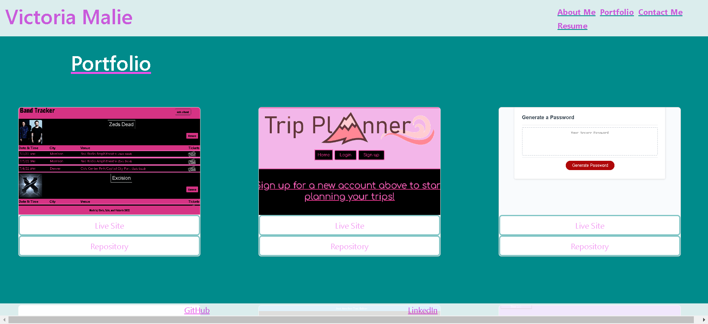
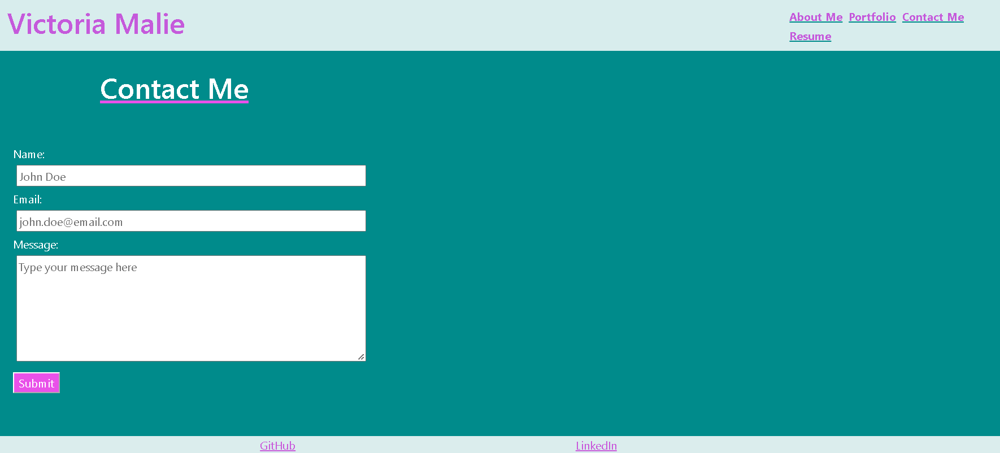
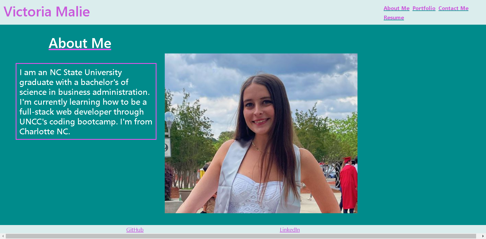
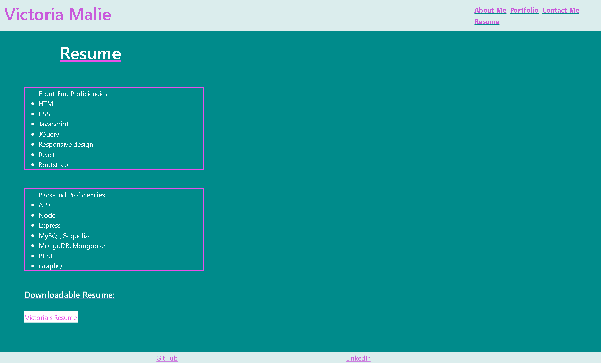

# react-portfolio

## Table of Contents
1. [Description](#description)
2. [Visuals](#visuals)
3. [Resources](#resources)

## Description

I've created a REACT portfolio that utilizes react components and "useState" to build a webpage.

I used the "useState" feature of react to switch through the different sections of the website without creating genuinely different pages. The nav bar functions by utilizing the "on click" feature to display the different html elements in the different files of the pages section.

In my portfolio section, I used bootstrap cards to organize the work I chose to feature. 

I used a form structure based off bootstrap and previous activities to build my contact me form. I utilized react to send different error messages when the form was filled out incorrectly.

I used CSS to do some styling, however I plan to improve upon the site's current CSS in the future (fixing the header layout, footer layout, and mobile compatibility).

## Visuals
Portfolio:

Contact:

About Me:

Resume:

## Resources
[Live Site](https://aqueous-beyond-13473.herokuapp.com/)

[Repository](https://github.com/vmalie3/react-portfolio)